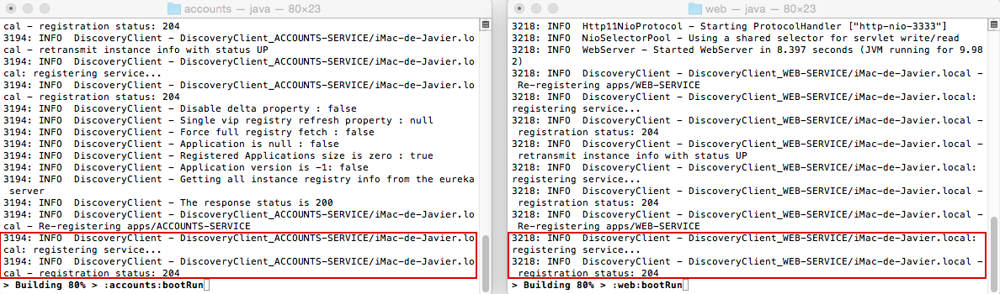
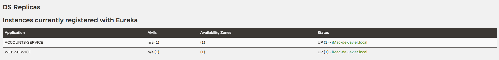
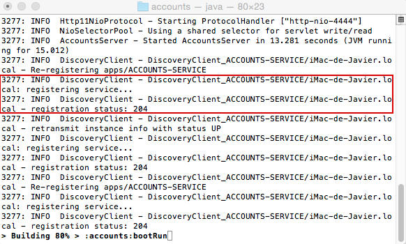

# Web Engineering 2015-2016 / Microservices

## Two services registered

## Registration has both services

## Another accounts service added

## What happens when killing microservice in 2222?
As we've registered a new Accounts service in port 4444, everything keeps working. The registration service detects that one service has been cancelled and, after that, it detects that another one exists, so the availability of the service is guaranteed.
